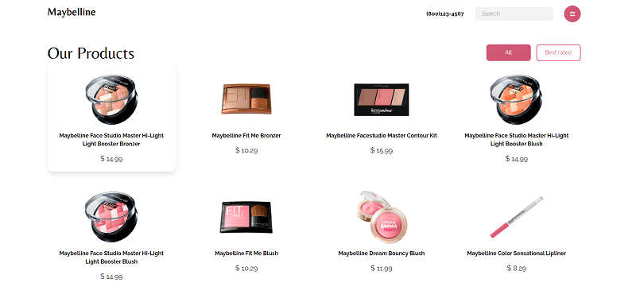
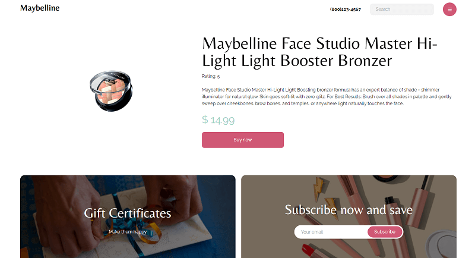

# Maybelline cosmetics 💄

## About

This is an online product catalog where you can see all Maybelline products directly from a [makeup API](https://makeup-api.herokuapp.com).

**Home**



**Product page**



You can see it alive [here](https://maybelline.netlify.app/).

## Technologies

- React.js ⚛
- Tailwind CSS 🌬
- Netlify 🌐
- Figma 🎨

## Getting started

If you want to run this project locally, you can:

1. Clone this project

```bash
git clone https://github.com/iscasur/maybelline-catalog.git

```

2. Go to the project's folder

```bash
cd maybelline-catalog
```

3. Install

```bash
npm install
```

4. Run development enviroment

```bash
npm run dev
```

## Resources

- [Foundations](https://www.figma.com/file/p1Of6xcBvKf1UWg8RqAHpq/maybelline_cosmetics?node-id=0%3A1)

## Licence

This project is MIT licensed
